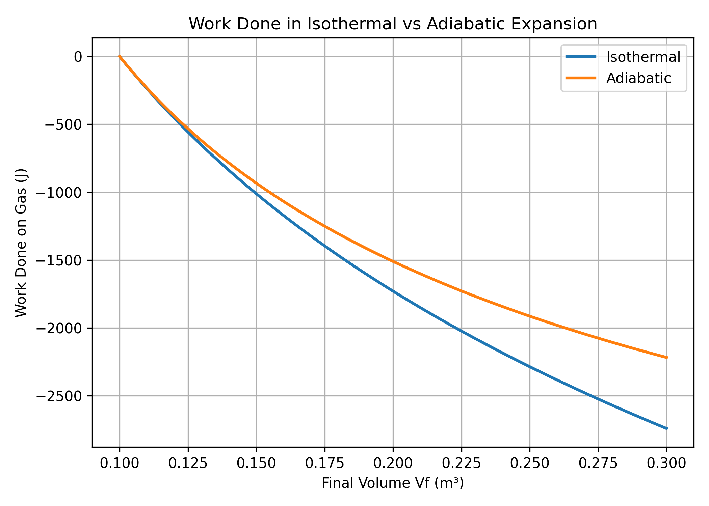

# Isothermal vs. Adiabatic Work
In the folder homework-4-1, I've included code to compute work using an isothermal process and an adiabatic process. These different processes led to different results which are shown in the graph below.

I will briefly compare both methods by looking at a few keypoints in their equations.

## Mathematical Expressions

**Isothermal work:**

$$w_{iso} = -\int_{V_i}^{V_f} \frac{nRT}{V}dV$$

**Adiabatic work:**

$$w_{adi} = -\int_{V_i}^{V_f} P(V)dV$$

Where

$$P(V) = \frac{constant}{V^γ}$$

## Conceptual Differences

Isothermal process: Occurs at constant temperature, so the internal energy of the gas remains constant (ΔU = 0). Therefore, all the heat added to the system is converted into work.

Adiabatic process: Occurs with no heat exchange (q = 0), so the work done comes completely from the gas’s internal energy.

## Computational Behavior

Both computations integrate *P(V)* with respect to *V*.

However, the isothermal process only has an inverse relationship to V, whilst the adiabatic process has a complex relationship with V due to the variable γ.

## Visual Comparison (from the plot)

Both curves start at the same initial point.

The isothermal curve drops more sharply, indicating smaller magnitude of work done.

The adiabatic curve decreases less steeply, showing greater work.

